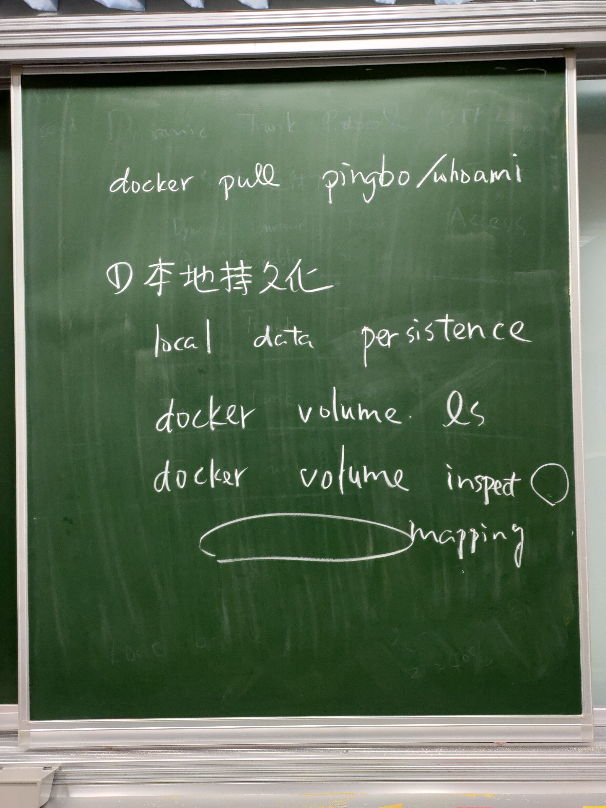
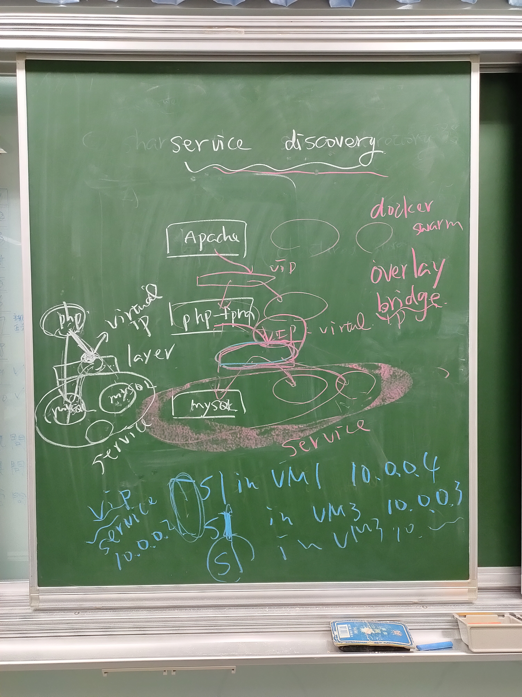

# 第十周           
            
            
            
## Docker Swarm 
### 三台虛擬機子其中兩台提供Web服務，但三台IP都能連到服務的container
```
//vm1(要記得先把docker swarm先設定好，可參考上周操作)
#docker pull pingbo/whoami
#docker service create --name web --replicas 2 -p 8000:8000 pingbo/whoami
//在瀏覽器上輸入IP:port，例如:192.168.56.103:8000，可以切換三台虛擬機的IP，都會出現那兩台開起Web服務的container ID。
#curl 192.168.56.103:8000    //跟開瀏覽器的顯示一樣，都會出現那兩台開起Web服務的container ID。
#curl 192.168.56.106:8000   //第二台主機沒開啟服務，但輸入還是看得到開在其他兩台開起Web服務的container ID。
#docker service rm web
```
### Docker集群管理Swarm数据持久化(參考:[Docker集群管理Swarm数据持久化](https://www.cnblogs.com/bigberg/p/8795265.html))
```
//vm1
#docker service create --replicas 3 --name web --mount type=volume,src=local_data,dst=/usr/local/apache2/htdocs httpd
#docker service update --publish-add 80:80 web  //開啟剛剛沒開的port
#docker volume ls   //可以看到docker創建後系統賦予的代號值，像剛剛設的local_data，就會在上面
#docker volume inspect local_data   //可以看到container在虛擬機上的位置
#cd /var/lib/docker/volumes/local_data/_data
#echo "I am in VM1" > hi.htm
#curl 192.168.56.103/hi.htm     //會看到vm1,vm2,vm3的hi.htm，但只有vm1有設定，所以只看到I am in VM1，其他兩台只看到Not Found的提示
//vm3
#docker volume ls   //因為下docker service create --replicas 3 ...，所以vm3會配到一台，可以看瀏覽器確認，找local_data位置
#cd /var/lib/docker/volumes/local_data/_data
#echo "I am in VM3" > hi.htm    
//vm1
#curl 192.168.56.103/hi.htm     //會看到vm1,vm2,vm3的hi.htm，但只有vm1,vm3有設定，所以只看到I am in VM1,I am in VM3，vm2只看到Not Found的提示
```
### Swarm共享儲存NFS
```
//vm1
#yum install -y nfs-utils
#systemctl start nfs
#systemctl enable nfs
#systemctl start rpcbind
//vm2
#yum install -y nfs-utils
//vm3
#yum install -y nfs-utils
//vm1
#mkdir /mydata -p
#mkdir /data/nfs_vol -p 
#gedit /etc/exports
/*
寫入一行指令：/data/nfs_vol 192.168.56.0/24(rw,sync,no_root_squash)  
/data/nfs_vol : 共享目錄
192.168.56.0/24 : 可以拜訪的主機網段
rw : 可讀寫，只讀權限ro
sync : 同步，數據安全，速度慢
async : 不同步，速度快，效率高，安全性低
no_root_squash ：NFS 服務共享目錄的屬性, 如果用戶是root,對這個目錄就有root的權限
*/
#systemctl restart nfs
//vm2
#mount -t nfs 192.168.56.103:/data/nfs_vol /tmp
#cd /tmp
#rm -rf *   //先清空
#touch vm2
//vm3
#mount -t nfs 192.168.56.103:/data/nfs_vol /tmp
#cd /tmp
#ls     //會有在vm2 touch的vm2
#touch vm3
#ls     //多了vm3
//vm2
#ls     //會有在vm3 touch的vm3，發現同步資料成功
//vm1
#cd /data/nfs_vol 
#ls     //會有在vm2,vm3建的東西
#touch vm1
//vm3
#ls     //會有在vm1 touch的vm1
```
```
//vm1
#docker service create --replicas 3 --name web -p 80:80 --mount 'type=volume,src=share_data,dst=/usr/local/apache2/htdocs,volume-driver=local,volume-nocopy=true,volume-opt=type=nfs,volume-opt=device=192.168.56.103:/data/nfs_vol,"volume-opt=o=addr=192.168.56.103,vers=4,soft,timeo=180,bg,tcp,rw"' httpd
#docker volume ls   //確認建置成功
#docker volume inspect share_data   //找share_data在虛擬機上位置，發現192.168.56.103:/data/nfs_vol掛載到/var/lib/docker/volumes/share_data/_data上
#cd /data/nfs_vol 
#echo "hi1" > hi1.htm
#curl 192.168.56.103/hi1.htm    //發現出現的都是hi1，跟一開始不同步的顯示結果不一樣
//vm3
#docker volume inspect share_data   //位址掛載和vm1設定一樣
```
### service discovery
```
//vm1
#docker service rm web  //清空服務
#docker network ls  //做service discovery要新建DRIVER(網路型態)為overlay
#docker network create --driver overlay mynet
#docker network ls  //確認NAME mynet,DRIVER overlay是否建立
#docker service create --replicas 2 --name s1 --network mynet httpd
#docker service create --name s2 --network mynet pingbo/whoami
#docker ps
#docker inspect cea     //觀察cea為開啟s1服務的其中一台機器ID，IP為10.0.0.4
//vm3
#docker ps
#docker inspect 9e2     //觀察9e2為開啟s1服務的另一台機器ID，IP為10.0.0.3
//vm1
#docker exec -it 4647572ca448 sh    //進入pingbo/whoami container(s2，4647572ca448)裡
#ping 10.0.0.4  //成功
#ping 10.0.0.3  //成功
#ping s1    //成功，並發現s1的IP addr為10.0.0.2
#exit
#docker service scale s1=3
#docker exec -it 4647572ca448 sh    
#ping s1    //成功，並發現s1的IP addr還是為10.0.0.2，所以s1不管開幾台，s1對外IP都一樣
#nslookup s1    //解析查到IP addr為10.0.0.2
#nslookup s2    //解析查到IP addr為10.0.0.57
#ip a       //但真正s2 IP為10.0.0.58，所以此法可以不用管服務開在哪個IP，對外全指向一個固定的IP，但一定要做overlay設定
```