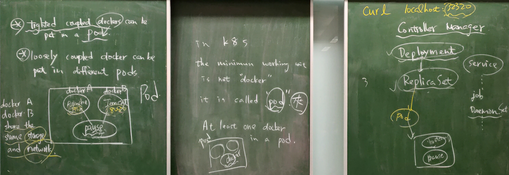
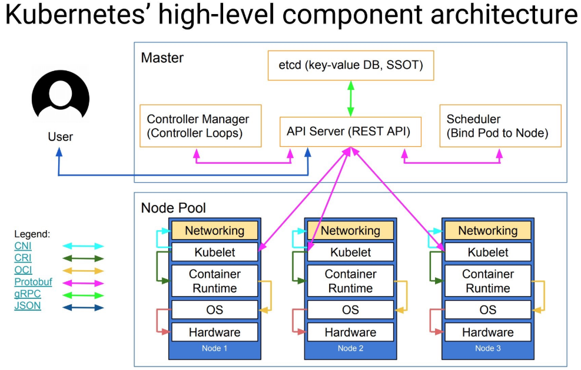

# 第十二周
## K8S(Kubernetes)(參考：[[Kubernetes] Cluster Architecture](https://godleon.github.io/blog/Kubernetes/k8s-CoreConcept-Cluster-Architecture/))
       
       
### 介紹
Kubernetes前身為Google Borg。Kubernetes與Docker有些相似有Master和一般工作節點，K8S跑內定設定masterru node是不會有任何動作，只有一般工作節點會有動作，於Master裡有一些重要節點：         
1. API Server(REST API)：所有的節點皆由此處做控制，兩種方式做控制，一種是使用者直接用文字命令對機子做控制，另一種是透過HTTP的方式(REST API)的方式連入並控制。      
2. etcd(key-value DB,SSOT)：分散式資料儲存系統，主要存key-value，儲存、查詢時會到這區做動作。      
3. Controller Manager(Controller Loops)：把指令送至Controller Manager，由Controller Manager去規劃，Controller Manager有很多元件，最常見的是deployment(佈署元件)，例如控制器要佈署三個副本，deployment就會呼叫kubelet set創造三個副本出來，如果有副本掛掉，kubelet set就會負責把掛掉的副本再建起來，維持副本數為三的狀態。     
4. Scheduler(Bind Pod to Node)      
> Kubernetes的demo set類似Docker swarm的global mode。   

一般工作節點有兩個重要的component(構件)：
1. Kubelet：例如控制器要佈署三個副本，從Controller Manager到API Server，再到Scheduler找出副本開在哪，再把開的位置給API Server，接著告訴Kubelet要開一個副本，Kubelet再傳CRI呼叫Container Runtime把container開起來(產生pod)，所以Kubelet為當下節點的代理者。
2. Kubeproxy：分配客戶請求到pod，可達到load blance(附載均衡)的作用。  
      
## K8S(Kubernetes)官網簡易操作([Interactive Tutorial - Creating a Cluster](https://kubernetes.io/docs/tutorials/kubernetes-basics/create-cluster/cluster-interactive/))   
```
$hostname   //顯示官網的機子名稱為minikube
$kubectl cluster-info   //顯示機子群集訊息(kubectl為kube control)
$kubectl run kubernetes-bootcamp --image=docker.io/jocatalin/kubernetes-bootcamp:v1 --port=8080
$kubectl get pods   //顯示開啟的pods的名稱與狀態，會看到剛剛建的一個pod
$kubectl get pods -o wide   //顯示更詳細開啟的pods資訊，如節點之類的資訊
$kubectl describe pod kubernetes-bootcamp-7bbd876467-2rzxg      //查詢pod的詳細狀態，如果一直開不起來可以觀察這個指令的訊息，kubernetes-bootcamp-7bbd876467-2rzxg為要查詢的pod
    /*
    如果輸入錯可以用以下指令砍掉設定錯的deployment
    $kubectl get deployment     //查詢deployment名稱
    $kubectl delete deployment kubernetes-bootcamp
    $kubectl get deployment     //檢查是否清空
    $kubectl get pods   //檢查是否清空
    */
$kubectl get deployment     //查詢deployment(佈署)，會發現剛剛設的 kubernetes-bootcamp狀態為READY
$kubectl get pods          //顯示開啟的pods的名稱與狀態
$kubectl describe deployment kubernetes-bootcamp    //查詢deployment(佈署)的詳細狀態，會顯示replicas(副本),Pod Template(Pod模板，裡面有Pod的Image，開啟的Port等資料)等等資料，kubernetes-bootcamp為要查詢的deployment(佈署)
$kubectl expose deployment/kubernetes-bootcamp --type="NodePort" --port 8080    //上面的指令只開啟群集內部訪問，這行指令開啟從外部訪問的應用
$kubectl get services   //查詢開啟的服務，會看到8080:30632/TCP，8080為群集內部訪問的port，30632為從外部訪問的port(30632為隨機所以可能顯示會不一樣)
$hostname
$curl minikube:30632     //顯示服務，要用開啟服務的host加對外的Port，才能顯示服務
$kubectl scale deployments/kubernetes-bootcamp --replicas=3      //讓副本開設三個
$kubectl get pods   //會看到三個pods
$curl minikube:30632    //一直下這個指令會發現，pods的代號會以剛剛查到的三台做輪流，有附載均衡功用
$kubectl get pods   //會看到三個pods
$kubectl delete pod kubernetes-bootcamp-7bbd876467-2rzxg    //砍掉剛剛查到的其中一個pod，kubernetes-bootcamp-7bbd876467-2rzxg為剛剛查到的其中一個pod
$kubectl get pods   //會看到三個pods，但有一台名字會與先前的不一樣，因為被砍掉了，為了要維持三個副本deployment會再開一台
$kubectl set image deployments/kubernetes-bootcamp kubernetes-bootcamp=jocatalin/kubernetes-bootcamp:v2    //全部跟新版本到v2
$kubectl get svc    //查服務port，svc為services
$curl minikube:30632    //會發現原本是v1版本，set image後跟新成v2版本了
$kubectl rollout undo deployments/kubernetes-bootcamp   //全部還原版本
$curl minikube:30632    //會發現還原成原本v1的版本了
```
## K8S(Kubernetes)虛擬機建置
開三台ubuntu，RAM開1024MB，2 CPU
```
$su //進到Root模式
#vim /etc/fstab     //把swap關掉，在前一行有# swap was on ...的句子前加#，#UUID=...(要注意事前一行有# swap was的)
#vim /etc/resolv.conf   //nameserver改成8.8.8.8
:wq
#apt-get update && apt-get install docker.io
#systemctl enable docker
#apt-get update && apt-get install -y apt-transport-https
/*
如果沒裝Curl下
#apt install curl
*/
#curl -s https://packages.cloud.google.com/apt/doc/apt-key.gpg | sudo apt-key add
#cat <<EOF >/etc/apt/sources.list.d/kubernetes.list
 deb http://apt.kubernetes.io/ kubernetes-xenial main
 EOF
#apt-get update
#apt-get install -y kubelet kubeadm kubectl
```