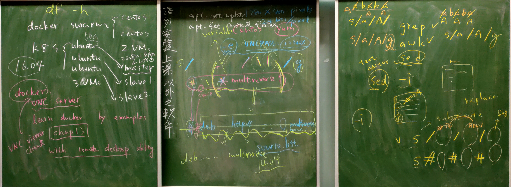

# 第七周
          
## DOCKER遠端連線       
當你在公司或某些特殊網路上，在有些網站被擋掉的情況下，用此遠端連線就可以輕鬆連線了。               
先在實體機上下載VNC Viewer(遠端)，虛擬機(本機)用上週從Github clone來的資料夾，用到ch13。          
記得把虛擬機防火牆及selinux關掉。               
```
#cd learn_docker_by_examples/
#cd ch13
#gedit Dockerfile &     //觀察這個Docker建置檔
#docker build -t larrysu/ch13_remoteubuntu .
#docker run -it --rm -p 5901:5901 -e USER=root larrysu/ch13_remoteubuntu bash -c "vncserver :1 -geometry 1280x800 -depth 24 && tail -F /root/.vnc/*.log"    //需要輸入一些密碼之類的，後面有不用這麼麻煩的作法。
#ifconfig       //記下IP
//在實體機上開啟VNC Viewer，把剛剛的IP:5901輸上去，就可以開啟遠端虛擬機了。
//進到實體機的遠端操作，打開LXTerminal。
$apt-get update     //先更新
$apt-get install firefox -y     //下載firefox，這樣就可以連網了，但要注意中文顯示為亂碼，所以要記得做修改。
```
修改檔案及指令簡化(檢查剛剛建的是否清掉，docker ps -a)：
```
#gedit Dockerfile & 
//在ENV HOME /root下一行加
ENV VNCPASS password    //預設密碼
//在RUN \裡有一行做設定可以直接安裝firefox，不用建完還要再做下載這麼麻煩。
apt-get install -y byobu curl git htop man unzip vim wget firefox && \
//還要在rm -rf那行下面加
RUN mkdir -p /root/.vnc
RUN echo ${VNCPASS} | vncpasswd -f > /root/.vnc/passwd
RUN chmod 600 /root/.vnc/passwd
//CMD ["bash"]改成
CMD vncserver :1 -name vnc -geometry 1024x768 && tail -f /root/.vnc/*:1.log
//儲存
#docker build -t larrysu/ch13_remoteubuntu:v1 .
#docker run -itd -p 5901:5901 --name desktop -e USER=root larrysu/ch13_remoteubuntu:v1
```
