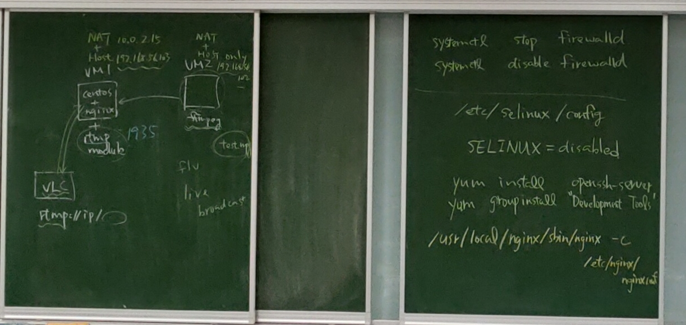
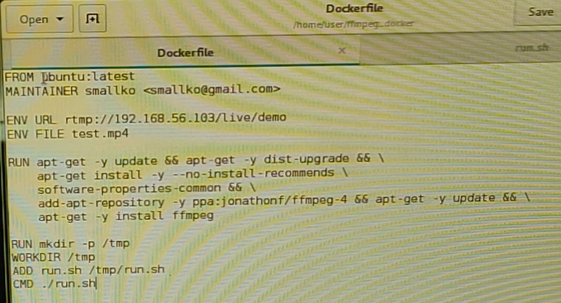
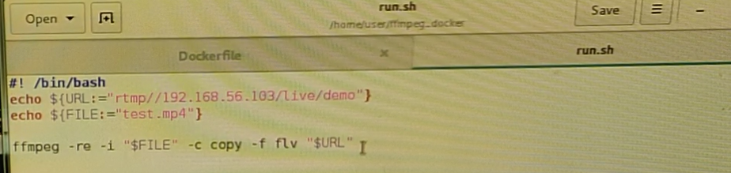

# 第八周

## 直播伺服器
在實體機上安裝VLC，開兩台虛擬機(p1,p2)，網卡都設定NAT加Hostonly，兩台虛擬機開啟後記得確認是否可以互相連線，且可以連到實體機
```
//兩台都要防火牆和seliunx要關
#systemctl stop firewalld
#systemctl disable firewalld
#cat /etc/selinux/config    //改成disable
#reboot
//p1
$su
#sudo yum install openssh-server -y
#systemctl start sshd
#sudo yum install pcre pcre-devel openssl openssl-devel zlib zlib-devel -y
#yum groupinstall "Development Tools"
#mkdir ~/temp
#cd ~/temp
#wget http://nginx.org/download/nginx-1.9.9.tar.gz
#wget https://github.com/arut/nginx-rtmp-module/archive/master.zip
#sudo yum install unzip
#tar -xvf nginx-1.9.9.tar.gz
#unzip master.zip
#cd nginx-1.9.9
#./configure --add-module=../nginx-rtmp-module-master/
#make
#sudo make install
#cd /usr/local/nginx
#mkdir /etc/nginx -p
#cd conf
#cp nginx.conf mime.types /etc/nginx
#gedit /etc/nginx/nginx.conf &
/*  在最下方加入
rtmp {
    server {
        listen 1935;
        chunk_size 4096;

        application live {
            live on;
            record off;
        }
    }
}
*/
#/usr/local/nginx/sbin/nginx -c /etc/nginx/nginx.conf
#netstat -tunlp | grep 80   
#netstat -tunlp | grep 1935 //檢查啟動後埠號
//p2
#sudo yum install epel-release -y
#sudo yum update -y
#sudo shutdown -r now
#sudo rpm --import http://li.nux.ro/download/nux/RPM-GPG-KEY-nux.ro
#sudo rpm -Uvh http://li.nux.ro/download/nux/dextop/el7/x86_64/nux-dextop-release-0-5.el7.nux.noarch.rpm
#sudo yum install ffmpeg ffmpeg-devel -y
#systemctl start sshd 
//開啟WinSCP(網卡跑掉用dhclient enp0s8)，把要播放的影片放到/home/user
#ffplay test.mp4
#ffmpeg -re -i test.mp4 -c copy -f flv rtmp://192.168.56.103/live/demo
//在實體機開VLC選擇開啟網路串流，輸入rtmp://192.168.56.103/live/demo就可以看到上傳的直播影片
```
## 用Docker開啟


```
//p2
#cd /home/user/ffmpeg_docker
#gedit Dockerfile &
#gedit run.sh &
#docker build -t larrysu/test_ffmpeg:v1 .
#docker run --rm -itd -v $PWD:/tmp -e FILE=test.mp4 -e URL=rtmp://192.168.56.103/live/demo larrysu/test_ffmpeg:v1 
#docker attach a07
//在實體機開VLC選擇開啟網路串流，輸入rtmp://192.168.56.103/live/demo就可以看到上傳的直播影片
```